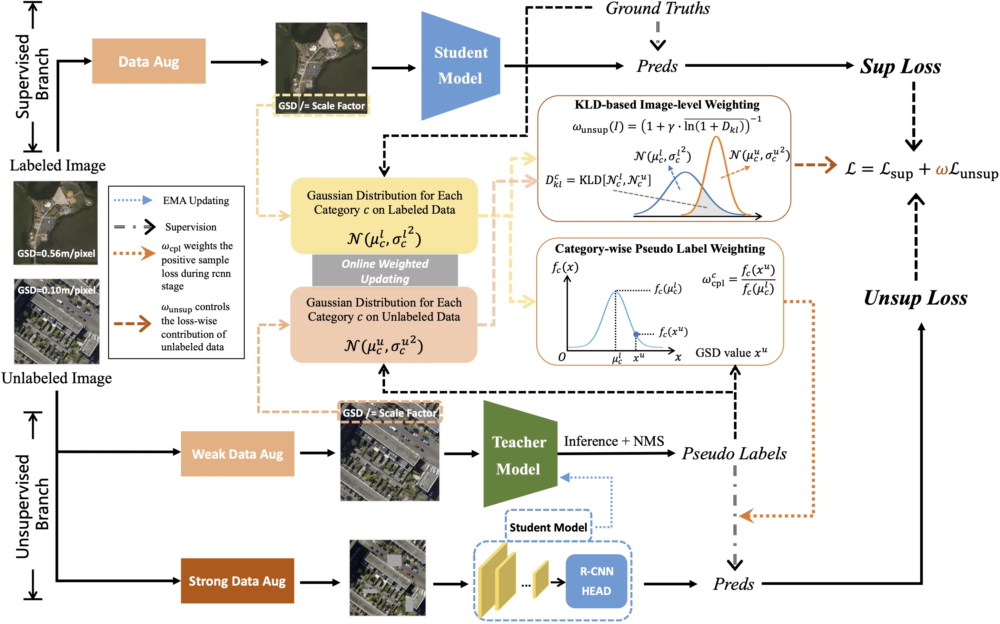

# SRGT: Spatial-Resolution-Guided Teacher for Robust Semi-Supervised Aerial Object Detection

This is the PyTorch implementation of our paper: 

**SRGT: Spatial-Resolution-Guided Teacher for Robust Semi-Supervised Aerial Object Detection** 



## Usage

```shell
cd ./thirdparty/OBBDetection/BboxToolkit && pip install -v -e .
cd .. && pip install -v -e .
cd ../.. && pip install -v -e .
```


## Acknowledgments 

This work is highly dependent on a series of excellent preliminary work. We would like to express our utmost thank to SoftTeacher, PseCo, mmdetection, and other projects not mentioned. 

We fully comply with the license of these projects, and there is no additional license for this project.


